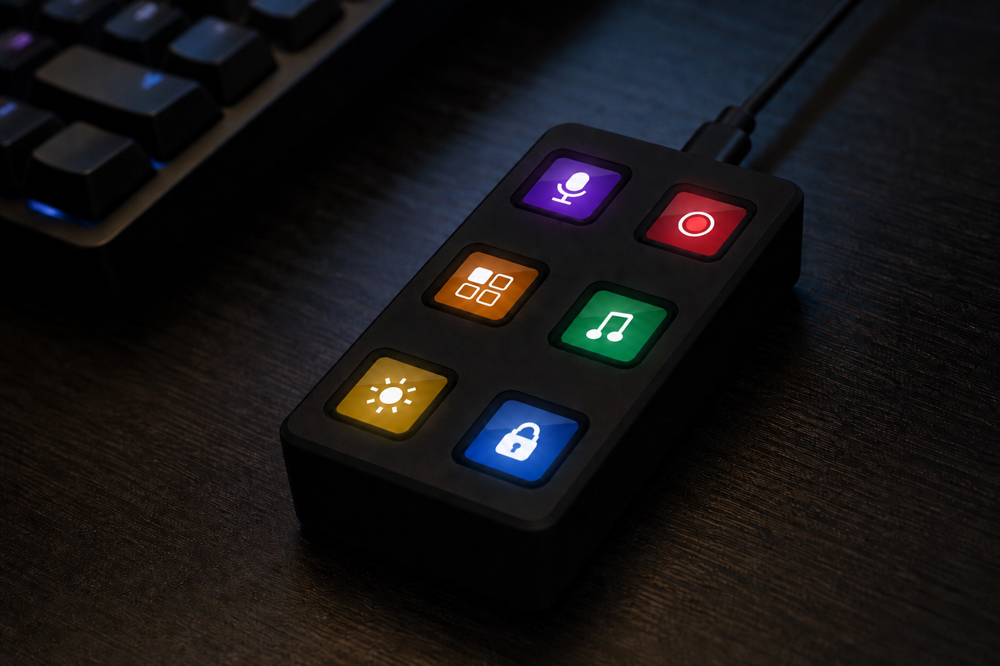

# Open Screen Deck

Six Waveshare ScreenKey modules (128×128 IPS + switch in each cap) on an
ESP32-S3 carrier you have fabricated, in a case you print. This repo is
the KiCad, Gerbers, OpenSCAD, STLs, firmware, and an optional desktop
companion.

[Build notes](https://vcazan.github.io/open-screen-deck/) ·
[Latest release](https://github.com/vcazan/open-screen-deck/releases/latest)
(macOS/Windows app + firmware `.bin`) ·
[Discord](https://discord.gg/PVCzBBeGQX)



## Build one

1. **Order** — 6× [Waveshare 34168](https://www.waveshare.com/0.85inch-screenkey.htm?sku=34168)
   (about $66, longest lead time). Upload
   [`hardware/pcb/data_streamdeck_gerbers.zip`](hardware/pcb/data_streamdeck_gerbers.zip)
   to [JLCPCB](https://jlcpcb.com) (about $15 for five boards). Full list:
   [`hardware/bom_assembly.csv`](hardware/bom_assembly.csv)
2. **Print** while those ship — four STLs in [`hardware/enclosure/stl/`](hardware/enclosure/stl/),
   PETG or PLA+, no supports:
   `deck_bottom_v14.stl`, `deck_top_v14.stl`, `corner_spacers_x4_v14.stl`,
   optional `deck_stand_v14.stl`
3. **Assemble** — [guide](https://vcazan.github.io/open-screen-deck/build/assembly/),
   about 45 minutes
4. **Flash** over USB-C — [companion](https://github.com/vcazan/open-screen-deck/releases/latest)
   (Settings → Firmware) or Arduino /
   [esptool](https://vcazan.github.io/open-screen-deck/firmware/flashing/).
   Same release has `firmware-0.14.5.bin` plus bootloader and partitions.

Parts land around **$100**. The six modules are most of that. v14 STLs
match the **Rev E** board (59.5 × 108.5 mm); don’t mix with older v13 prints.

| | |
|--|--|
| **Keys** | 6× Waveshare 0.85″ ScreenKey (SKU 34168) |
| **Board** | ESP32-S3-WROOM-1-N16R8 on a **59.5 × 108.5 mm** Rev E carrier |
| **On board** | IMU, VEML7700 ALS, DRV2605L haptics, piezo, 8× SK6812, Qwiic |
| **Displays** | Dual SPI (J1–J3 + SD / J4–J6), 40 MHz + DMA |
| **Case** | 64.9 × 113.9 × 28.2 mm printed deck + optional 25° stand |
| **Firmware** | 0.14.5 (protocol 14) — HID keyboard F13–F24 by default |

Pinout lives in [`hardware/pinout.py`](hardware/pinout.py). Generators
refuse to run if `firmware/config.h` disagrees.

## Firmware

Sources in [`firmware/`](firmware/). Out of the box it types F13–F24.
Pages, labels, icons, microSD animations, auto-dim, glow LEDs, and haptics
are configured over USB serial
([protocol](https://vcazan.github.io/open-screen-deck/firmware/protocol/)).

Prebuilt images are on
[Releases](https://github.com/vcazan/open-screen-deck/releases/latest)
(`firmware-0.14.5.bin`, `.bootloader.bin`, `.partitions.bin`). The companion
bundles the same files. To compile locally:

```bash
./scripts/build_firmware.sh          # also copies bins into the app
./scripts/build_firmware.sh --flash  # then upload to a connected deck
```

Arduino: ESP32S3 Dev Module, USB CDC On Boot enabled, USB-OTG, OPI PSRAM,
16 MB flash (`app3M_fat9M_16MB`). Libraries: Adafruit GFX, ST7735, NeoPixel.

## Companion app

Optional. The deck is a USB keyboard without it. Use the app to draw key
faces, bind host actions, flash firmware, and (on Rev E) drive auto-dim /
glow / self-test.

- **Download:** [Releases](https://github.com/vcazan/open-screen-deck/releases/latest)
  — macOS `.dmg` (unsigned: right-click → Open), Windows `.msi`
- **From source:** `cd app && npm install && npx tauri dev`
- **Plugins:** folders in [`plugins/`](plugins/);
  [directory](https://vcazan.github.io/open-screen-deck/plugins/) ·
  [`plugins/registry.json`](plugins/registry.json)

A push to `main` updates this repo and the docs site. A **GitHub Release**
(installers + firmware bins) is created only when a tag `app-v*` is pushed,
e.g. `app-v0.2.0`.

## Repo map

```
hardware/
  pinout.py          Canonical GPIO + Rev E geometry
  pcb/               KiCad, Gerbers, board BOM
  enclosure/         OpenSCAD v14 + printable STLs
  3d/                Fastener / assembly STEP
firmware/            ESP32-S3 Arduino (0.14.5)
app/                 Tauri companion (Rust + React)
plugins/             Bundled plugins + registry.json
profiles/            Shared layouts (.osdprofile.json)
docs/                MkDocs site
scripts/             PCB / schematic / firmware helpers
```

## Contributing

- **Plugins** — folder in `plugins/` + a registry line
  ([how](https://vcazan.github.io/open-screen-deck/plugins/develop/))
- **Profiles** — export from the app, PR into `profiles/`
- **Hardware** — OpenSCAD is parametric; keep the
  [mechanical contract](docs/mechanical_contract.md) if the PCB should still fit
- **App / firmware** — `cd app && npm test && npm run test:e2e`

## Related projects

Same neighbourhood: [FreeTouchDeck](https://github.com/DustinWatts/FreeTouchDeck)
(one touchscreen), [open-deck](https://github.com/joshr120/open-deck) (one TFT
behind keys), [MacroPad](https://github.com/yuvasaro/MacroPad) (per-key OLED).
This one is six discrete ScreenKey modules on a carrier you can order.

## License

- **Firmware, app, scripts, docs:** [MIT](LICENSE)
- **Hardware (PCB + enclosure):** [CERN-OHL-P v2](hardware/LICENSE)

ScreenKey modules are a [Waveshare](https://www.waveshare.com) product; this
project is not affiliated with or endorsed by Waveshare or Elgato.
