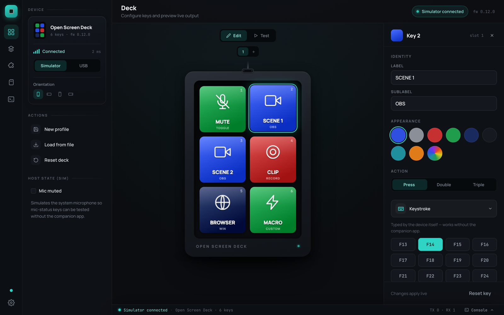
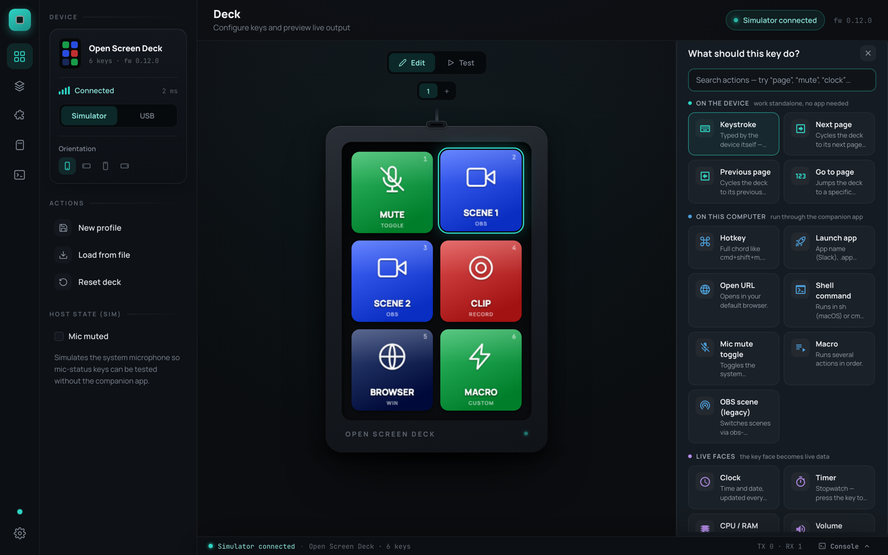
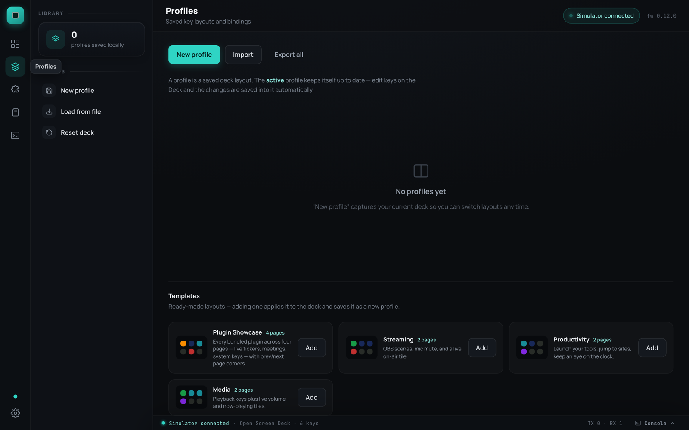
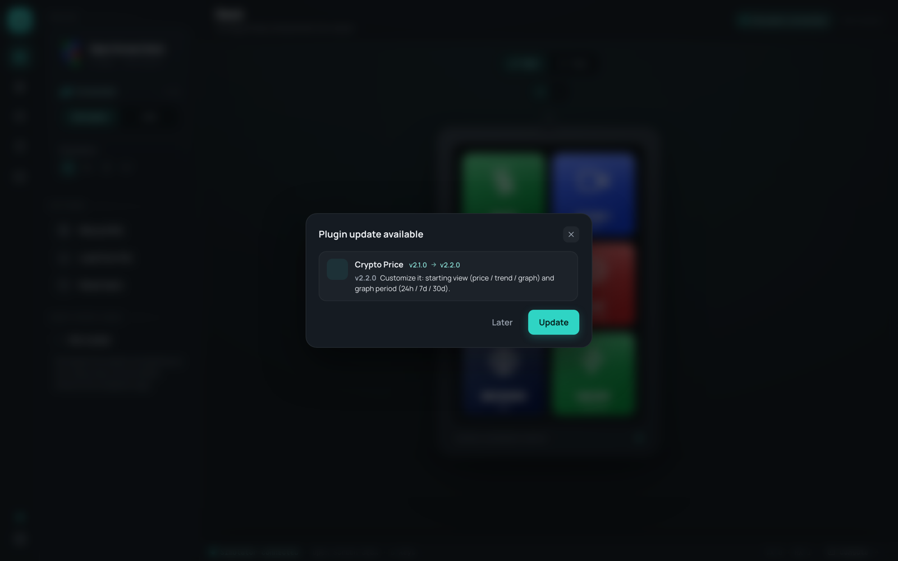

# Companion App

The desktop companion turns the deck from a HID macro pad into a Stream
Deck-class controller — and the deck still works standalone when the app
isn't running.

{ .app-shot }

Download from [GitHub Releases](https://github.com/vcazan/open-screen-deck/releases),
or [build it yourself](development.md) (Tauri 2 — Rust backend, React front).

## How it works

```
key press ──USB CDC──▶ companion (Tauri/Rust) ──▶ action engine ──▶ macOS/Windows
key faces ◀──SET_KEY / SET_FACE / SET_IMAGE── state engine + plugins ◀── OS
```

On connect the companion sends `MODE COMPANION`; the firmware stops typing
F13–F24 itself and just reports key events. A `PING` every 2 s is the
heartbeat — if the companion dies or the cable is pulled, the firmware
reverts to plain HID within 6 s. **The deck always works, with or without
software.**

## Configuring keys

Click any key and the inspector opens: label, color, icon, animation, and
what the key does.

{ .app-shot }

Choosing an action is a visual gallery — every option is a card with an
icon and a one-liner, grouped by where it runs. Search filters live.

{ .app-shot }

| Action | Runs on | Notes |
|--------|---------|-------|
| Keystroke (F13–F24) | device | works without the companion |
| Next / Previous / Go to page | device | firmware-owned, works standalone |
| Hotkey (`cmd+shift+m`) | host | needs macOS Accessibility permission |
| Launch app | host | picking an app also puts its logo on the key |
| Open URL | host | default browser |
| Shell command | host | `sh -lc` / `cmd /C` |
| Mic mute toggle | host | live two-state face (configurable colors/labels) |
| Live tiles | host | clock, timer, CPU/RAM, volume, now playing, OBS scene |
| Macro | host | steps with per-step delay |
| Plugin actions | host | from [installed plugins](../plugins/index.md) |

### Multi-tap

Every key can hold **single, double, and triple press** actions. The
firmware is smart about latency: keys with only a single action fire
instantly; keys with multi-tap bindings use a short tap window. Works on
the device and on-screen.

### Pages

Decks start with one page and grow to **8 pages × 6 keys = 48 slots**.
The page count lives on the device (NVS-persisted) and inside each
profile, so applying a 3-page profile resizes the deck. Page-switch keys
ride reserved HID codes, so they work standalone.

## Key faces & media

- **Images** — drop a PNG/JPG on a key; crop interactively to 128×128.
  Transparent pixels adopt the key's background color and follow recolors.
- **Icons** — a searchable library of ~7,400 Material Design Icons.
- **Animations** — drop a GIF or video; frames upload to the deck's
  microSD and play on-device, even standalone.
- **Live tiles and plugin faces** stream as draw-only frames — no SD wear.

Plugins draw fully custom faces (tickers, clocks, progress rings) and own
their keys' look:

{ .app-shot }

## Profiles

A profile is a saved deck layout — configs, actions, page count, and
media. The **active** profile auto-saves as you edit. Profiles export as
self-contained `.osdprofile.json` files (**Share** on any card); community
layouts live in the repo's
[`profiles/`](https://github.com/vcazan/open-screen-deck/tree/main/profiles)
folder. Ready-made **templates** (including a four-page Plugin Showcase)
apply with one click:

{ .app-shot }

Profiles can also **auto-activate per app** — switch to OBS and your
streaming profile loads itself.

## Editing niceties

- **Drag & drop** — drag one key onto another to swap their full identity
- **Copy/paste** — ++cmd+c++ / ++cmd+v++ on a selected key
- **Undo/redo** — ++cmd+z++ / ++shift+cmd+z++, up to 50 steps
- **Test mode** — flip the deck into Test and click keys to fire their
  real actions

## Plugins

The **Plugins** page is a full store: browse the
[plugin directory](../plugins/index.md), install with one click, and click
any plugin for its detail page — live face previews, customization
defaults, settings (like the OBS connection), and the full changelog.
When a plugin ships an update, the app asks first and shows the release
notes:

{ .app-shot }

Want to build one? Head to the [developer center](../plugins/develop.md) —
scaffold to working plugin in under a minute.

## Firmware updates

Settings → Firmware shows the version on the deck vs. the version bundled
with the app. One click reboots the deck into its ROM bootloader, flashes
over USB (~30 s), and restarts it. No Arduino IDE, no esptool. A recovery
option un-sticks decks left in bootloader mode.
