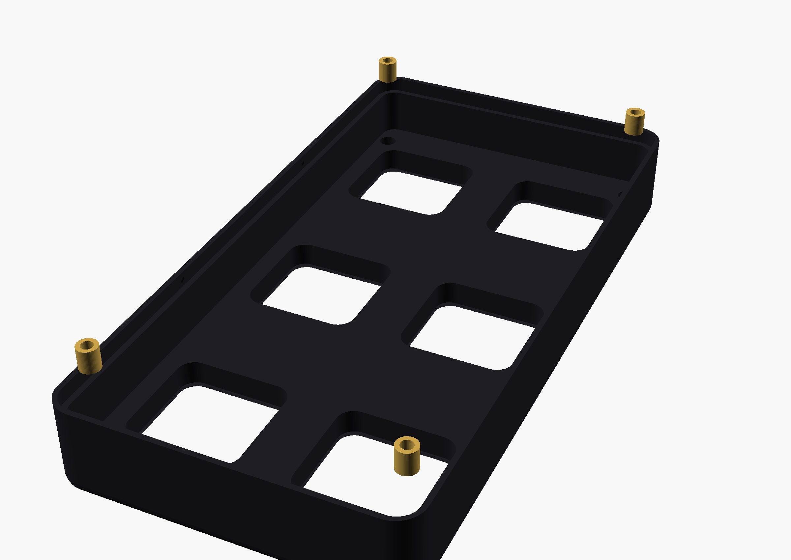
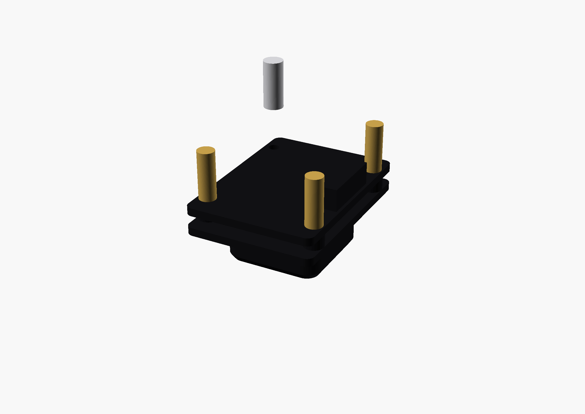
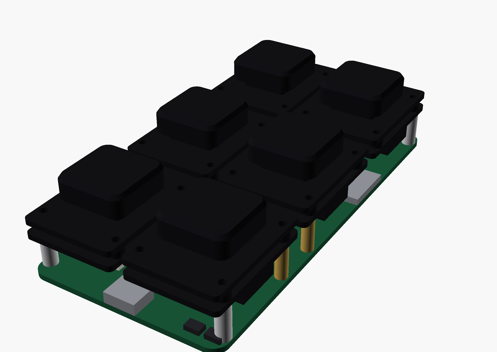
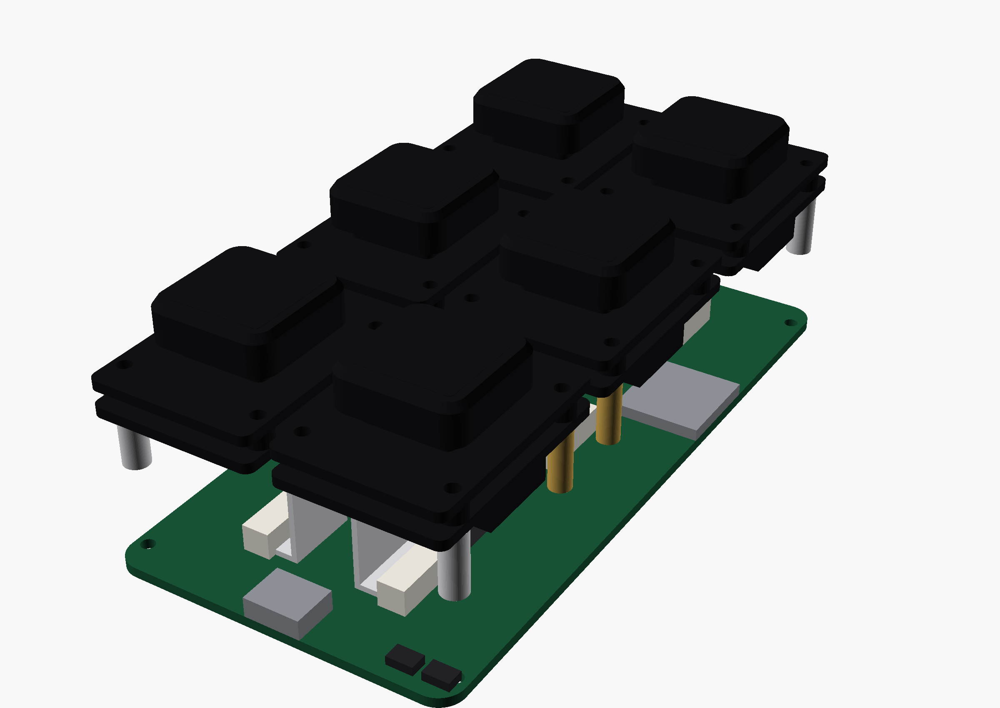
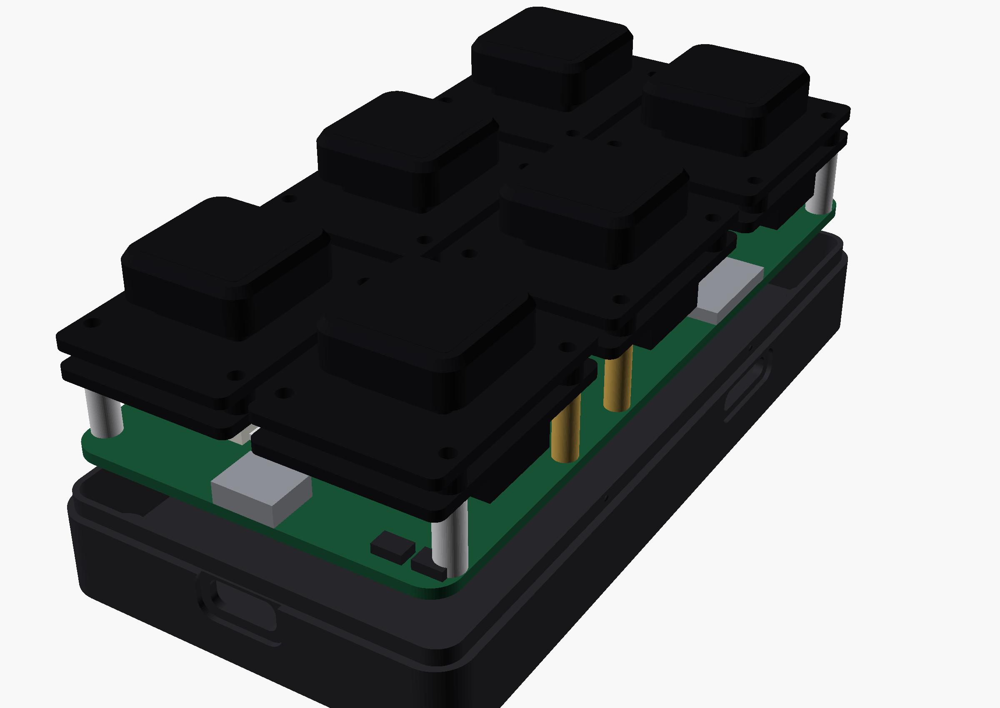
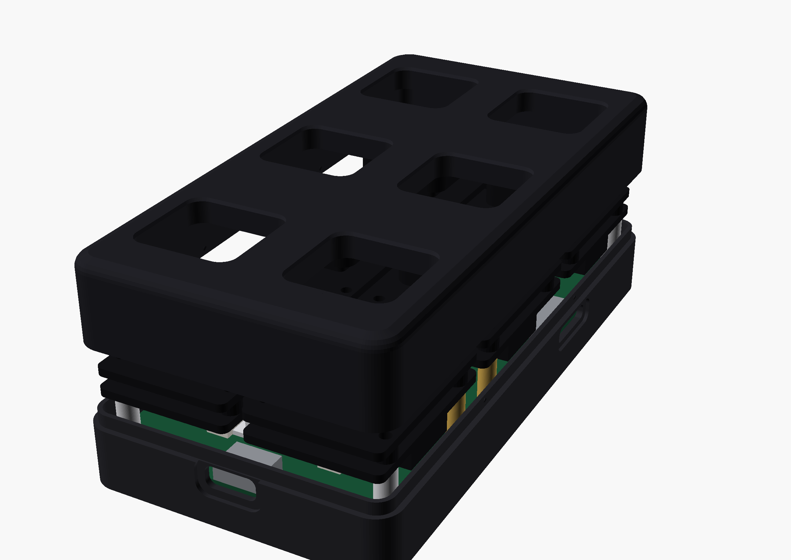
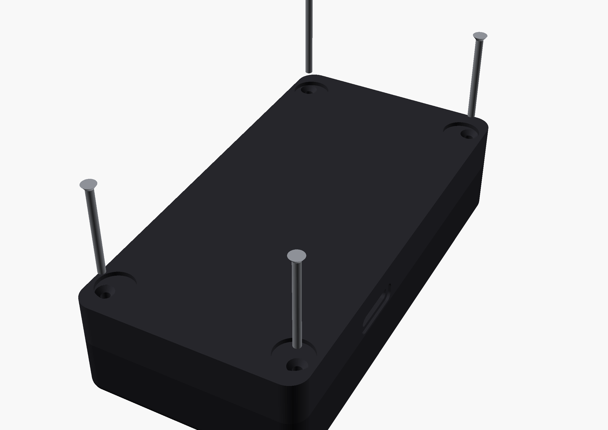

# Assembly Guide

Build time: **~45 minutes** once all parts are printed and on hand.
Difficulty: you've soldered once and can drive a 1.5 mm hex key — you're fine.

## What you need

All purchased parts are listed in the [Parts List](../getting-started/parts.md).
Print the four parts from
[`hardware/enclosure/stl/`](https://github.com/vcazan/open-screen-deck/tree/main/hardware/enclosure/stl/)
first — see [3D Printing](../getting-started/printing.md) for settings.

| Part | File | Print notes |
|------|------|-------------|
| Bottom tray | `deck_bottom_v11.stl` | Flat on bed, no supports |
| Top shell | `deck_top_v11.stl` | Face-down, no supports |
| Corner spacers ×4 | `corner_spacers_x4_v11.stl` | 100% infill recommended |
| Desk stand (optional) | `deck_stand_v11.stl` | Upright, 15–20% infill |

PETG or PLA+, 0.2 mm layers, 3 walls.

**Tools:** soldering iron (for the heat-set inserts), 1.5 mm hex driver, small
hex driver for M2×5, tweezers.

---

## Step 1 — Heat-set inserts into the top shell

Install the **4× Ruthex RX-M2x4** inserts into the four holes on the
**underside of the top shell's face plate** (one near each corner, directly
above where the corner keys sit). Soldering iron at ~220 °C, press gently
until flush. Let it cool before assembly.

!!! warning "Hot inserts"
    Soldering iron at ~220 °C. Press gently until flush, then let the insert
    cool completely before handling the top shell.

## Step 2 — Prepare the ScreenKey modules

Each Waveshare module ships with 4 brass standoffs installed. They unscrew
by hand.

- **The 4 deck-corner positions:** on each corner module, remove the one
  standoff that faces the deck corner and set the **printed spacer sleeve**
  in its place. The case screw passes through it in the final step.
- **The 8 skipped positions:** remove the standoffs that would land on the
  ESP32, USB-C, or microSD (the carrier has no holes there — hold the module
  over the board and it's obvious which ones).
- Leave every other standoff installed.

## Step 3 — Screw the modules to the carrier

Sit each module on the carrier (connector footprints show the orientation)
and drive **M2×5 screws from the underside** of the carrier into the factory
standoff tips — **12 screws total; the 4 corner positions get no screw yet.**
Snug, not gorilla-tight — the threads are brass.

The corner spacers just sit in place for now; they're captured when the
corner screws go in at the end.

!!! tip "Brass threads"
    Snug the M2×5 screws — do not overtighten. The factory standoff tips are
    brass.

## Step 4 — Connect the cables

Connect each module to its carrier connector (J1–J6) with the **200 mm
MX1.25 cable included in every module box**. Both ends are identical —
plug one into the module's 9-pin connector, one into the carrier, and fold
the slack flat under the module. The 9.7 mm standoff height is exactly the
room the folded cable needs.

## Step 5 — Into the tray

Drop the loaded carrier into the bottom tray — it lands on the four corner
posts, and the USB-C connector lines up with the rear slot.

## Step 6 — Top shell

Snap the top shell onto the tray. The tongue-and-groove rim registers it;
the side snaps click when seated. Keys should protrude through the apertures
and press freely.

## Step 7 — Corner screws

Flip the deck. Drive the **4× M2×25 countersunk screws** into the corner holes (they sit inside the rubber-foot recesses). Each one
passes through the tray, the carrier, the printed spacer, threads through
the corner module's soldered nut, and lands in the top-plate insert —
one screw per corner clamps the entire stack together.

Stop when the flat head seats flush in its countersink. Do not overtighten.

!!! warning "Do not overtighten"
    Stop when the flat head seats flush in its countersink. The corner module
    nuts and brass standoffs will strip if forced.

## Step 8 — Finish

- Stick the 4 rubber feet in the corner recesses — they cover the screw heads, so no fasteners are visible anywhere on the deck.
- (Optional) insert a FAT32 microSD through the right-side slot for
  on-device icons/animations.
- Plug in USB-C and [flash the firmware](../firmware/flashing.md).
- (Optional) set the deck in the printed stand for a 25° desk angle.

Done — plug in USB-C and verify each key in the serial monitor or on the host.
