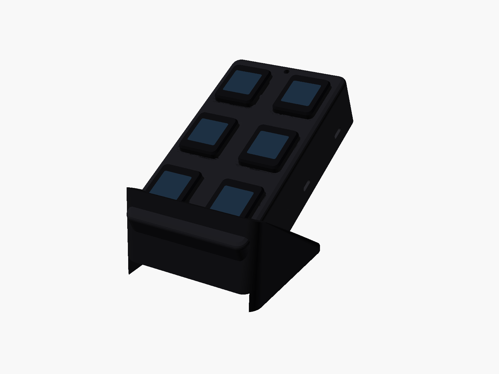

# Hardware Overview

Open Screen Deck is a 6-key macro pad where every key is a self-contained
128×128 LCD module on a custom ESP32-S3 carrier PCB, in a 3D-printed case.

**Rev E** is the current board: dual SPI, on-board IMU + ambient light +
haptics, eight edge-glow LEDs, and a Qwiic port.

## Specifications

| | |
|--|--|
| **Keys** | 6× Waveshare 0.85″ ScreenKey (SKU 34168) — LCD + mechanical switch in one module |
| **Screens** | 128×128 IPS per key, ST7735, **dual SPI** (J1–J3 + SD on bus A, J4–J6 on bus B) |
| **MCU** | ESP32-S3-WROOM-1-N16R8 (16 MB flash, 8 MB PSRAM) soldered on carrier |
| **Carrier PCB** | **59.5 × 108.5 mm**, 2-layer, ENIG, matte black |
| **Sensors** | LSM6DS3TR-C IMU (pickup/tap), VEML7700 ambient light (auto-dim) |
| **Feedback** | DRV2605L haptic driver + LRA jack, piezo, 8× SK6812MINI-E edge glow |
| **Expansion** | Qwiic / StemmaQT on the shared I2C bus |
| **Host link** | USB-C → HID keyboard (F13–F24) + CDC serial at 115200 baud |
| **Media** | microSD for on-device icons/animations, or stream frames over USB |
| **Enclosure** | v14: **64.9 × 113.9 × 28.2 mm** flat deck + optional 25° stand; LED wall windows + ALS light-pipe |
| **Fasteners** | 4× M2×25 corner screws through module nuts; 12× M2×5 module screws |

## Source files

All hardware sources live in the GitHub repo:

| Component | Location |
|-----------|----------|
| Canonical pinout | [`hardware/pinout.py`](https://github.com/vcazan/open-screen-deck/blob/main/hardware/pinout.py) |
| KiCad schematic + PCB | [`hardware/pcb/`](https://github.com/vcazan/open-screen-deck/tree/main/hardware/pcb/) |
| OpenSCAD enclosure | [`hardware/enclosure/`](https://github.com/vcazan/open-screen-deck/tree/main/hardware/enclosure/) |
| Printable STLs | [`hardware/enclosure/stl/`](https://github.com/vcazan/open-screen-deck/tree/main/hardware/enclosure/stl/) |
| Fastener / assembly STEP | [`hardware/3d/`](https://github.com/vcazan/open-screen-deck/tree/main/hardware/3d/) |
| Assembly BOM | [`hardware/bom_assembly.csv`](https://github.com/vcazan/open-screen-deck/blob/main/hardware/bom_assembly.csv) |

## Order a PCB

1. Generate fab outputs: `./scripts/build_hardware.sh`
2. Upload `hardware/pcb/data_streamdeck_gerbers.zip` to
   [JLCPCB](https://jlcpcb.com) (~$15 for five boards)
3. SMT assembly is recommended on Rev E — IMU, ALS, haptic driver, and
   eight 3535 LEDs are fiddly by hand. Component list in `hardware/pcb/bom.csv`

See the [Fab Checklist](../build/fab-checklist.md) for pre-order verification
and bring-up tests.

## Deep dives

- [Mechanical contract](mechanical.md) — enclosure ↔ PCB interfaces, fasteners
- [PCB design brief](pcb.md) — layout, pinout, sensors, connectors
- [ScreenKey module reference](screenkey-module.md) — Waveshare SKU 34168 specs
- [Product architecture](architecture.md) — media storage, dual SPI, I2C
