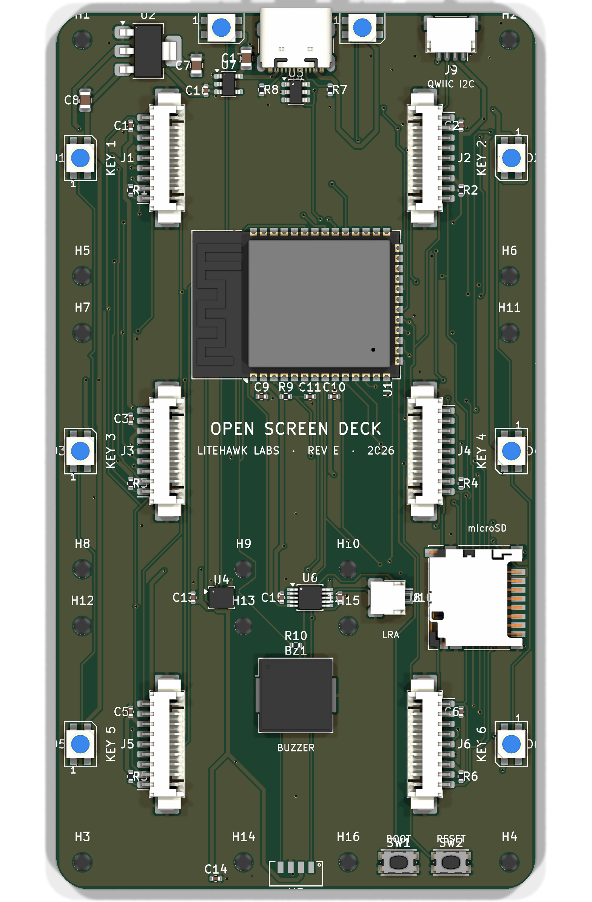
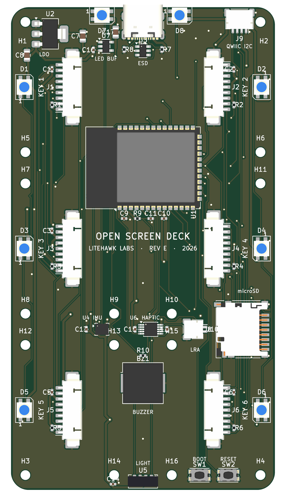

# Carrier PCB Design Brief (Rev E)

Reference: [ScreenKey Module](screenkey-module.md) (Waveshare **SKU 34168**)  
**Canonical pinout: [`hardware/pinout.py`](https://github.com/vcazan/open-screen-deck/blob/main/hardware/pinout.py)** — schematic and PCB generators consume it and hard-fail if `firmware/config.h` disagrees.

**Status: routed + DRC-clean.** Fab outputs live in `hardware/pcb/gerbers/`.

{ .app-shot }

---

## What's new in Rev E

Rev D was a working 6-key carrier. Rev E keeps that layout and adds the
on-board sensing and feedback the enclosure was designed around:

| Subsystem | Part | What it does |
|-----------|------|----------------|
| **IMU** | LSM6DS3TR-C | Pickup / tap detect — the deck ticks when you lift it |
| **Ambient light** | VEML7700 | Auto-dims the six backlights through a face-plate light pipe |
| **Haptics** | DRV2605L + LRA jack | Click feedback on key press; optional coin motor on J10 |
| **Piezo** | CUI CPT-9019S | Optional beep alongside (or instead of) the LRA |
| **Edge glow** | 8× SK6812MINI-E | Per-key status (6) + rear link/SD indicators (2), 5 V via a level shifter |
| **Qwiic** | JST-SH 4P | Extra I2C sensors on the same bus, out the rear wall |

Also in this rev: **uniform 11 mm cap-to-cap gaps** (the board grew to
**59.5 × 108.5 mm**), **dual SPI** so a full-deck redraw is ~15 ms instead
of ~60 ms, and a single pinout source so firmware and copper cannot drift.

Added board cost is about **$4–6**.

---

## Board specification

| Parameter | Value |
|-----------|-------|
| PCB size | **59.5 × 108.5 mm** |
| Shape | Rectangular (r=4 corners), 4× Ø2.2 corner case-screw holes on the corner-module standoff axes |
| Mounting | **Flat** in bottom shell (centred under key grid) |
| Layers | 2-layer |
| Min trace | 0.2 mm signal / 0.5 mm power |
| Min via | 0.3 mm drill / 0.6 mm pad |
| Finish | ENIG, matte black solder mask |

---

## Layout

Uniform **11 mm cap-to-cap gaps** both axes: column pitch **33.0 mm**, row
pitch **36.3 mm**.

### J1–J6 centres (board origin 0,0 = back-left)

| Ref | Col | Row | X | Y |
|-----|-----|-----|---|---|
| J1 | 0 | 0 | 13.25 | 17.95 |
| J2 | 1 | 0 | 46.25 | 17.95 |
| J3 | 0 | 1 | 13.25 | 54.25 |
| J4 | 1 | 1 | 46.25 | 54.25 |
| J5 | 0 | 2 | 13.25 | 90.55 |
| J6 | 1 | 2 | 46.25 | 90.55 |

### Major placements

| Ref | Part | Notes |
|-----|------|-------|
| U1 | ESP32-S3-WROOM-1-N16R8 | Centre corridor between rows 0 and 1 |
| J7 | USB-C GCT USB4105 | Port exits rear edge, centred at X=29.75 |
| J8 | microSD Hirose DM3D-SF | Card mouth faces the x=59.5 edge (side-wall slot) |
| U2 | AMS1117-3.3 1 A LDO | Rear-left strip, VBUS → 3V3 |
| U3 | USBLC6-2SC6 ESD | USB D+/D−/VBUS |
| U4 | LSM6DS3TR-C IMU | I2C, INT1 → GPIO9 |
| U5 | VEML7700 ALS | I2C, drives backlight auto-dim |
| U6 | DRV2605L haptic | I2C + EN=GPIO44, LRA on J10 |
| U7 | 74AHCT1G125 | 3.3 V → 5 V LED data |
| J9 | Qwiic / StemmaQT | Rear edge next to USB |
| J10 | LRA motor (JST-SH 2P) | Optional haptic actuator |
| BZ1 | Piezo | GPIO43 LEDC |
| D1–D6 | SK6812MINI-E | Beside each key, outer edge |
| D7–D8 | SK6812MINI-E | Rear corners — link / SD |
| SW1 / SW2 | BOOT / RESET | Front strip, clear of the rear sensors |

---

## Connectors J1–J6

**Molex PicoBlade 53261-0971** — 9-pin 1.25 mm right-angle SMD.

The 200 mm cable included in every Waveshare module box plugs straight in
(pin 1 → pin 1; verify straight-through before buying spares).

### Pin order (Waveshare SPI module — pin 1 = KEY)

| Pin | Signal | Bus A (J1–J3) | Bus B (J4–J6) |
|-----|--------|---------------|---------------|
| 1 | KEY | GPIO per table below | GPIO per table below |
| 2 | DC | GPIO 14 (DC_A) | GPIO 8 (DC_B) |
| 3 | CS | GPIO per table below | GPIO per table below |
| 4 | SCLK | GPIO 12 (SCK_A) | GPIO 18 (SCK_B) |
| 5 | DIN | GPIO 11 (MOSI_A) | GPIO 17 (MOSI_B) |
| 6 | GND | GND | GND |
| 7 | VCC | +3V3 | +3V3 |
| 8 | PWM | GPIO 13 (BL, LEDC) | GPIO 13 (shared) |
| 9 | RST | GPIO 21 (shared) | GPIO 21 (shared) |

### Per-module GPIO

| Module | Bus | CS | KEY |
|--------|-----|-----|-----|
| J1 | A | 10 | 38 |
| J2 | A | 1 | 39 |
| J3 | A | 2 | 40 |
| J4 | B | 3 | 41 |
| J5 | B | 4 | 42 |
| J6 | B | 5 | 47 |

**Dual SPI:** bus A (FSPI) also carries the microSD (CS=16, MISO=15).
Panels run 40 MHz with DMA on both buses at once.

### Other subsystem GPIO

| Signal | GPIO | Notes |
|--------|------|-------|
| SDA / SCL | 6 / 7 | I2C: IMU + ALS + haptics + Qwiic |
| IMU_INT | 9 | LSM6DS3TR-C INT1, wake-on-pickup |
| LED_DATA | 48 | SK6812 chain, 5 V via 74AHCT1G125 |
| PIEZO | 43 | LEDC tone |
| HAPTIC_EN | 44 | DRV2605L EN |

Pins avoid IO35–37 (octal PSRAM) and leave the boot-strap pins clean.

---

## Decoupling

- **C1–C6:** 100 nF 0402 on each Jx pin 7 (VCC), ≤2 mm from connector
- **C7/C8:** 10 µF 0805 bulk at LDO in/out
- **C9/C10:** 100 nF at U1; **C11** 1 µF on EN
- 100 nF at U4, U5, U6, U7 + 10 µF near the LED chain 5 V feed

---

## Mounting holes

All Ø2.2 (M2 free fit):

- **H1–H4 corner case screws** @ **(3.25, 3.32), (56.25, 3.32), (3.25, 105.17), (56.25, 105.17)** —
  on the corner modules' outermost soldered-nut axes (M2×25 case screws,
  see [Mechanical](mechanical.md))
- **H5–H16 module standoffs** @ the usable positions of the **20.0 × 29.25**
  per-module pattern from the official vendor drawing

---

## BOM

| Qty | Ref | Part |
|-----|-----|------|
| 1 | U1 | ESP32-S3-WROOM-1-N16R8 (soldered) |
| 6 | J1–J6 | Molex PicoBlade 53261-0971 — 9-pin 1.25 mm right-angle |
| 1 | J7 | USB-C receptacle, GCT USB4105 |
| 1 | J8 | microSD, Hirose DM3D-SF push-push |
| 1 | U2 | AMS1117-3.3 1 A LDO |
| 1 | U3 | USBLC6-2SC6 USB ESD protection |
| 1 | U4 | LSM6DS3TR-C 6-axis IMU |
| 1 | U5 | VEML7700 ambient light |
| 1 | U6 | DRV2605L haptic driver |
| 1 | U7 | 74AHCT1G125 LED data level shifter |
| 8 | D1–D8 | SK6812MINI-E RGB LED |
| 1 | BZ1 | SMT piezo (CUI CPT-9019S) |
| 1 | J9 | JST-SH 4P Qwiic / StemmaQT |
| 1 | J10 | JST-SH 2P LRA motor |
| 2 | SW1, SW2 | BOOT / RESET tactile switches |
| 6 | — | Waveshare MX1.25 9P cable (included with each module) |

Full line-item board BOM: `hardware/pcb/bom.csv`. Case fasteners and feet
are in the [parts list](../getting-started/parts.md).

---

## Fabrication

- **59.5 × 108.5 mm** 2-layer FR4 1.6 mm, ENIG
- JLCPCB / PCBWay: ~$15 / 5 pcs

See the [Fab Checklist](../build/fab-checklist.md) for ordering and bring-up.
