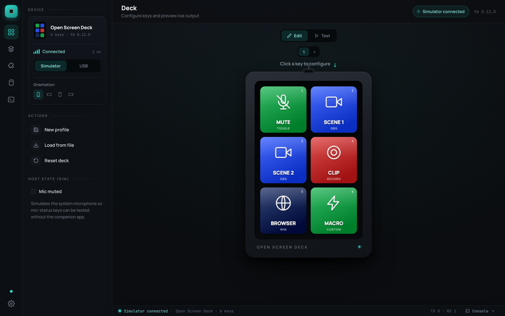
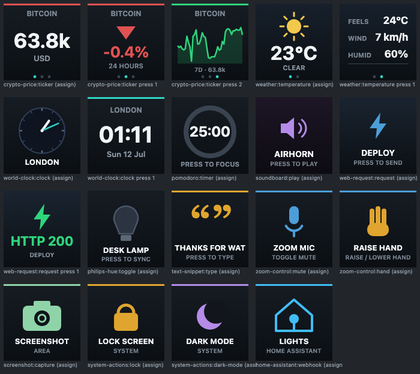

# Open Screen Deck

{ .hero-image }

**A per-key LCD macro pad — open hardware, open firmware, open software.**
Six Waveshare ScreenKey modules (128×128 IPS inside every key), an
ESP32-S3 carrier PCB, a 3D-printed case, and a desktop companion app with
plugins. Every file to build, flash, and extend it lives in
[one repo](https://github.com/vcazan/open-screen-deck).

The project is three open pieces that work as one:

-   :material-chip:{ .lg .middle } __Hardware__

    ---

    KiCad PCB + Gerbers, OpenSCAD case + STLs, full BOM (~$100 in parts),
    and an illustrated 45-minute assembly guide.

    [:octicons-arrow-right-24: Parts list](getting-started/parts.md) ·
    [Assembly](build/assembly.md) ·
    [PCB & mechanical](hardware/overview.md)

-   :material-flash:{ .lg .middle } __Firmware__

    ---

    ESP32-S3 Arduino firmware: USB HID keyboard + serial protocol, per-key
    LCDs, microSD animations, multi-page, multi-tap — works standalone.

    [:octicons-arrow-right-24: Flashing](firmware/flashing.md) ·
    [Serial protocol](firmware/protocol.md)

-   :material-monitor:{ .lg .middle } __Companion app__

    ---

    A Stream Deck-class editor for macOS/Windows: visual key editor,
    profiles, live tiles, in-app firmware updates — and a plugin store.

    [:octicons-arrow-right-24: App tour](app/index.md) ·
    [Development](app/development.md)

-   :material-puzzle:{ .lg .middle } __Plugins__

    ---

    Crypto tickers, weather, OBS, Hue, Home Assistant… all drawing custom
    key faces. Browse the live directory or build your own in minutes.

    [:octicons-arrow-right-24: Plugin directory](plugins/index.md) ·
    [Developer center](plugins/develop.md)

## The app

{ .app-shot }

Keys are configured visually — click a key, pick an action from a
searchable gallery, drop an image or icon on it, and it's on the device
instantly. Plugins draw fully custom faces:

{ .app-shot }

[Take the full tour →](app/index.md)

## Key specs

| | |
|--|--|
| **Keys** | 6× Waveshare 0.85″ ScreenKey (SKU 34168) — LCD + mechanical switch in one module |
| **Screens** | 128×128 IPS per key, ST7735, shared SPI |
| **Pages** | up to 8 pages × 6 keys = 48 slots, switchable on-device |
| **MCU** | ESP32-S3-WROOM-1 (16 MB flash, 8 MB PSRAM) on a 55×112 mm carrier |
| **Host link** | USB-C → standard HID keyboard (F13–F24) + CDC serial for config |
| **Media** | microSD for on-device icons/animations, or stream frames over USB |
| **Case** | 59.7 × 116.7 × 28.2 mm printed deck + optional 25° stand |
| **Software** | Tauri companion app (macOS/Windows) with a plugin store — optional, the deck works without it |

## Start here

- **I want to build one** → [Parts list](getting-started/parts.md), then the
  [assembly guide](build/assembly.md)
- **I built one** → [Flash the firmware](firmware/flashing.md), then grab the
  [companion app](app/index.md)
- **I want to extend it** → [Plugin developer center](plugins/develop.md) or
  the [serial protocol](firmware/protocol.md)

!!! note "About the images"
    Hardware renders and assembly illustrations are from CAD; app images
    are real screenshots. Dimensions and fit may change after the first
    physical build is documented in the repo.
