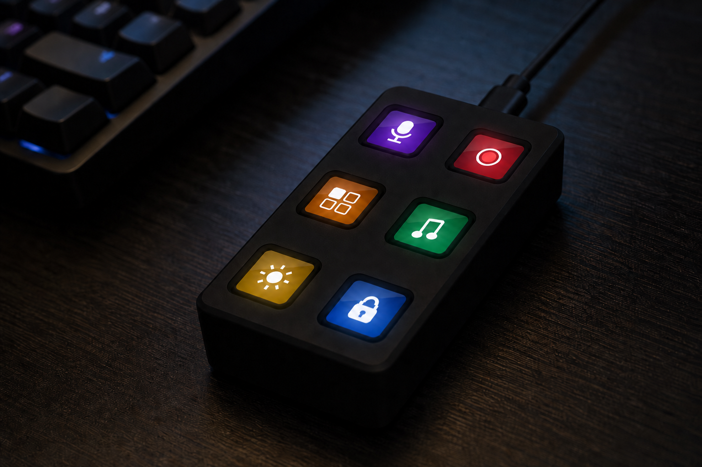

# Open Screen Deck

{ .hero-image }

Six Waveshare ScreenKey modules (128×128 IPS per key), an ESP32-S3 carrier
PCB, and a 3D-printed case. The deck enumerates as a USB keyboard (F13–F18
by default) and accepts icon/animation updates over USB or from a microSD
card. KiCad, OpenSCAD, and firmware sources are in this repo.

-   :material-cart:{ .lg .middle } __Parts list__

    ---

    BOM with links, estimated costs, and suggested order.

    [:octicons-arrow-right-24: Parts list](getting-started/parts.md)

-   :material-hammer-wrench:{ .lg .middle } __Assembly__

    ---

    Eight-step build guide — about 45 minutes once parts are printed.

    [:octicons-arrow-right-24: Assembly guide](build/assembly.md)

-   :material-flash:{ .lg .middle } __Firmware__

    ---

    Arduino IDE setup, libraries, and first upload over USB-C.

    [:octicons-arrow-right-24: Flashing guide](firmware/flashing.md)

-   :material-chip:{ .lg .middle } __Hardware__

    ---

    PCB pinout, mechanical stack, and serial protocol.

    [:octicons-arrow-right-24: Hardware overview](hardware/overview.md)

## Key specs

| | |
|--|--|
| **Keys** | 6× Waveshare 0.85″ ScreenKey (SKU 34168) — LCD + mechanical switch in one module |
| **Screens** | 128×128 IPS per key, ST7735, shared SPI |
| **MCU** | ESP32-S3-WROOM-1 (16 MB flash, 8 MB PSRAM) on a 55×112 mm carrier |
| **Host link** | USB-C → standard HID keyboard (F13–F18) + CDC serial for config |
| **Media** | microSD for on-device icons/animations, or stream frames over USB |
| **Case** | 59.7 × 116.7 × 28.2 mm printed deck + optional 25° stand |
| **Fasteners** | 4 corner screws close the whole thing — they thread through the key modules' own mounting nuts |

!!! note "About the images"
    Renders and assembly illustrations on this site are from CAD. Dimensions
    and fit may change after the first physical build is documented in the repo.
