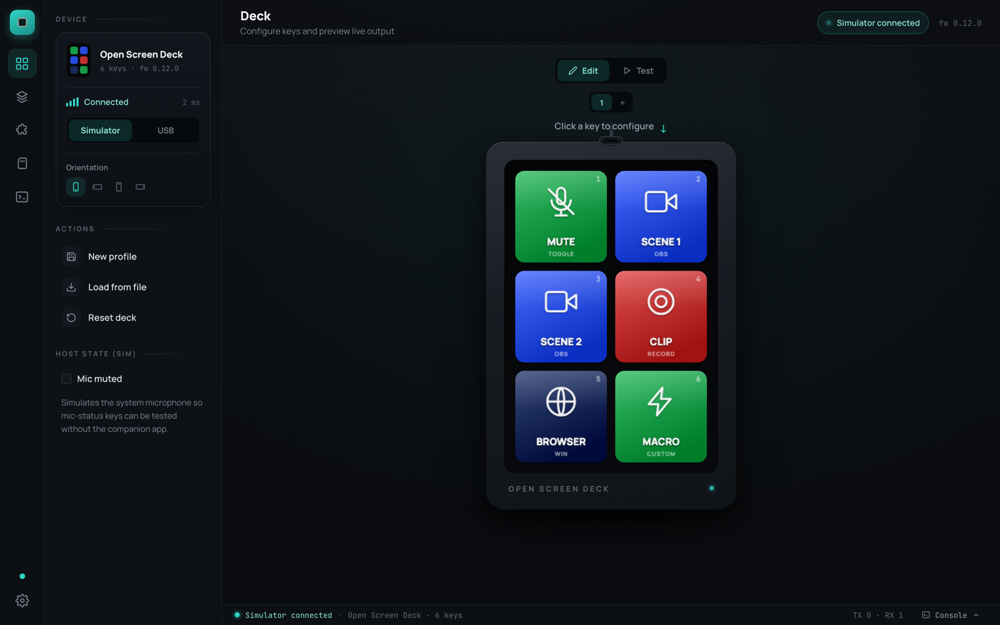

# Open Screen Deck

Six mechanical keys, each with its own 128×128 screen, on an ESP32-S3
carrier you order and a case you print. KiCad, Gerbers, OpenSCAD, STLs,
firmware, and a desktop companion all live in the
<a href="https://github.com/vcazan/open-screen-deck">GitHub repo</a>.
Nothing here is sold as a kit — you build it.

  <a class="md-button md-button--primary" href="getting-started/parts/">
    Start a build
  </a>
  <a id="dl-mac" class="md-button"
     href="https://github.com/vcazan/open-screen-deck/releases/latest">
    macOS app
  </a>
  <a id="dl-win" class="md-button"
     href="https://github.com/vcazan/open-screen-deck/releases/latest">
    Windows app
  </a>

{ .hero-image }

## How a build goes

Order the six ScreenKey modules first — they take the longest. While they
ship, send the Gerbers to a board house and print the case. Assembly is
four corner screws and the in-box cables. Then flash over USB-C.

1. **[Order parts](getting-started/parts.md)** — six Waveshare 34168
   modules (about $66), a Rev E PCB from JLCPCB, M2 screws, inserts, feet.
   Whole bill is about $100.
2. **[Print the case](getting-started/printing.md)** — four STLs, PETG or
   PLA+, no supports. Do this while the PCB is in transit.
3. **[Assemble](build/assembly.md)** — heat-set four inserts, screw the
   modules to the carrier, plug the cables, close the shell. About 45
   minutes if you've soldered once.
4. **[Flash firmware](firmware/flashing.md)** — Arduino IDE or the
   companion app. After that it enumerates as a USB keyboard.

The [build overview](build/index.md) is the same four steps with links.

## What's in the repo

-   :material-chip:{ .lg .middle } __Hardware__

    ---

    KiCad project and Gerbers for the Rev E carrier (59.5 × 108.5 mm),
    OpenSCAD + printable STLs, pinout in `hardware/pinout.py`. Order five
    boards, keep one, remix the rest.

    [:octicons-arrow-right-24: Parts](getting-started/parts.md) ·
    [PCB](hardware/pcb.md) ·
    [Enclosure](hardware/mechanical.md)

-   :material-flash:{ .lg .middle } __Firmware__

    ---

    Arduino sketch for the ESP32-S3. Out of the box it types F13–F24.
    Pages, icons, animations, and the Rev E sensors (IMU, ambient light,
    haptics, glow LEDs) are configured over serial.

    [:octicons-arrow-right-24: Flashing](firmware/flashing.md) ·
    [Protocol](firmware/protocol.md)

-   :material-puzzle:{ .lg .middle } __Companion app__

    ---

    Optional. The deck works as a HID keyboard without it. Use the app
    when you want to draw key faces, assign host actions, or flash a
    newer firmware. Plugins are ordinary folders; scaffold one in-app.

    [:octicons-arrow-right-24: Using the app](app/index.md) ·
    [Write a plugin](plugins/develop.md)

## Once it's together

Plug it in — keys send F13–F24 until you change them. The companion (macOS
or Windows, or [build it from `app/`](app/development.md)) talks over the
same USB-C cable:

- Click a key to set label, colour, icon, GIF, or a host action (launch,
  hotkey, URL, shell, mic, OBS, …)
- Up to 8 pages on the device; layouts save as profiles you can share
- Plugins draw their own faces (clocks, tickers, progress) — list is in
  the [plugin directory](plugins/index.md)
- Settings can flash firmware and, on Rev E, drive auto-dim, glow, and a
  hardware self-test

{ .app-shot }

## Specs (Rev E)

| | |
|--|--|
| **Keys** | 6× Waveshare 0.85″ ScreenKey — 128×128 IPS + switch per key |
| **Pages** | up to 8 × 6 = 48 slots, switched on the device |
| **MCU** | ESP32-S3-WROOM-1 (16 MB flash, 8 MB PSRAM) |
| **Carrier** | 59.5 × 108.5 mm, 2-layer, dual SPI to the panels |
| **On board** | IMU, VEML7700 ALS, haptic driver, piezo, 8× SK6812, Qwiic |
| **Host** | USB-C → HID keyboard + CDC serial |
| **Case** | 64.9 × 113.9 × 28.2 mm printed deck + optional 25° stand |
| **Parts** | ~$100 ($66 is the six modules) |

!!! note "Photos"
    Hardware pictures are CAD or board renders until more assembled units
    are documented. App screenshots are from the real UI.

